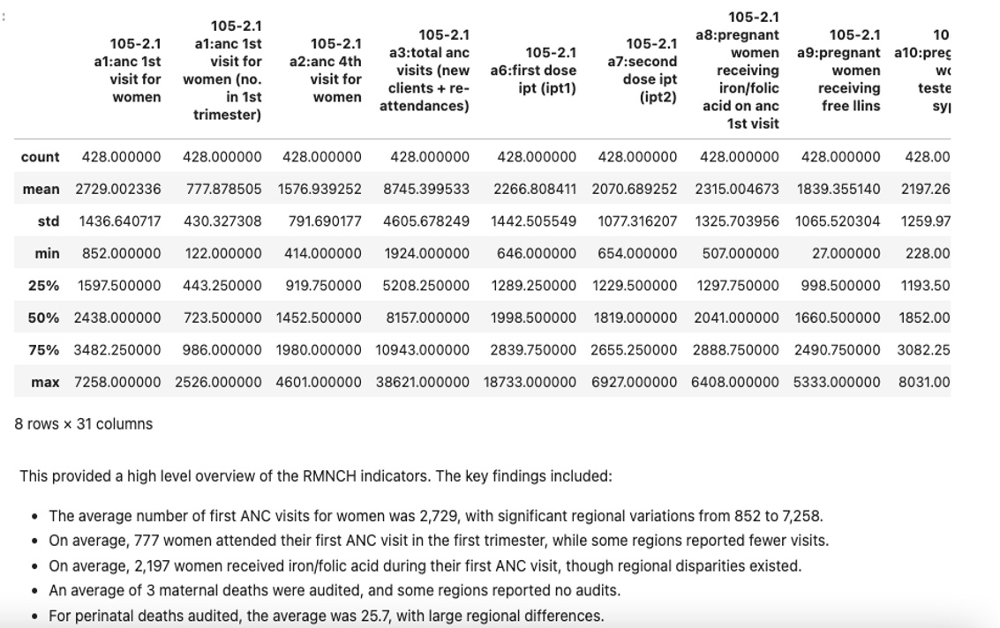
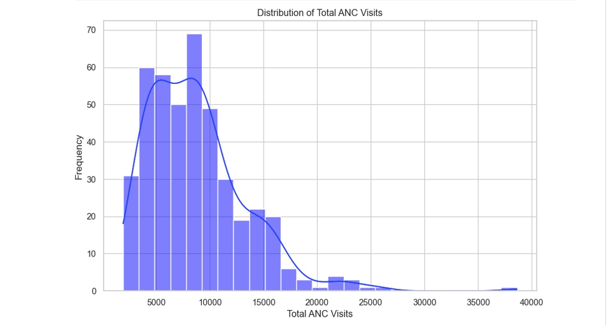

# Exploratory Data Analysis of Maternal and Child Health Data
Exploratory Data Analysis (EDA) was conducted to better understand the RMNCH dataset and uncover key trends in reproductive, maternal, newborn, and child health. By exploring the data, I aimed to gain insights into the distribution and trends of essential health indicators like antenatal care (ANC) visits and deliveries, which are vital to improving maternal and child health outcomes in Southwest Uganda. The following steps outline the EDA process:

## Summary Statistics:
The first step was to generate summary statistics for the numerical columns in the dataset. This helped to identify the central tendencies, spread, and potential outliers in key variables such as ANC visits, deliveries, and postnatal care.

Below is the Python code that was used to generate the summary statistics:
```python
# Get summary statistics for numerical columns
df.describe()
```


This provided a high level overview of the RMNCH indicators. The key findings included:

• The average number of first ANC visits for women was 2,729, with significant regional variations from 852 to 7,258.

• On average, 777 women attended their first ANC visit in the first trimester, while some regions reported fewer visits.

• On average, 2,197 women received iron/folic acid during their first ANC visit, though regional disparities existed.

• An average of 3 maternal deaths were audited, and some regions reported no audits.

• For perinatal deaths audited, the average was 25.7, with large regional differences.

• On average, 294 caesarian sections were performed, with variation from region to region.

### Distribution of Total Antenatal care (ANC) Visits:
Antenatal care (ANC) visits is one of the key RMNCH indicators. I visualized the total number of ANC visits using a histogram with a kernel density estimate (KDE) in order to understand the distribution of this variable. Below is the Python code that was used to plot the distribution of the total ANC visits (New clients + Re-attendances):
```python
%matplotlib inline
import matplotlib.pyplot as plt
import seaborn as sns
# Set plot style
sns.set(style="whitegrid")
# Plot the distribution of 'Total ANC visits (New clients + Re-attendances)'
plt.figure(figsize=(10, 6))
sns.histplot(df['105-2.1 a3:total anc visits (new clients + re-attendances)'], kde=True, color='blue')
plt.title('Distribution of Total ANC Visits')
plt.xlabel('Total ANC Visits')
plt.ylabel('Frequency')
plt.show()
```

