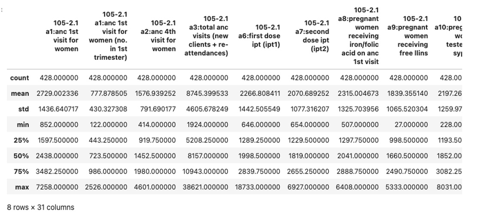

# Exploratory Data Analysis of Maternal and Child Health Data
Exploratory Data Analysis (EDA) was conducted to better understand the RMNCH dataset and uncover key trends in reproductive, maternal, newborn, and child health. By exploring the data, I aimed to gain insights into the distribution and trends of essential health indicators like antenatal care (ANC) visits and deliveries, which are vital to improving maternal and child health outcomes in Southwest Uganda. The following steps outline the EDA process:

## Summary Statistics:
The first step was to generate summary statistics for the numerical columns in the dataset. This helped to identify the central tendencies, spread, and potential outliers in key variables such as ANC visits, deliveries, and postnatal care.

Below is the Python code that was used to generate the summary statistics:
```python
# Get summary statistics for numerical columns
df.describe()
```

